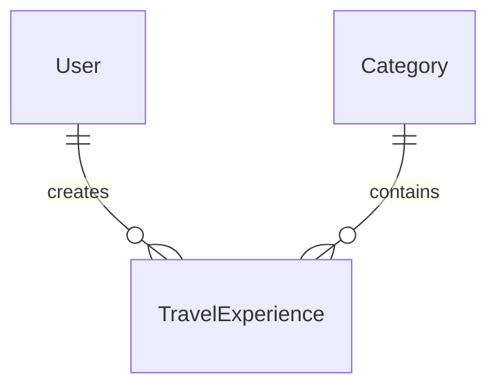

# ✈️ 100 Ways Travel — 百途旅行

探索 **100 种旅行方式**，发现世界之美。

全栈 Next.js 14 项目，暗色霓虹风格，SQLite + Prisma 数据持久化，JWT 鉴权后台管理。

---

## 🖼️ 预览

| 前台页面 | 后台管理 |
|:---:|:---:|
| 首页 · 详情 · 搜索 · 关于 | 仪表盘 · 体验CRUD · 分类管理 |
| 暗色玻璃态 + 霓虹发光 | 侧边栏 + 表格 + 表单 |

---

## 🛠️ 技术栈

| 类别 | 技术 |
|---|---|
| 框架 | Next.js 14 (App Router, TypeScript) |
| 样式 | Tailwind CSS 3.4 + 自定义霓虹插件 |
| 字体 | Inter + Space Grotesk (next/font/google) |
| 数据库 | SQLite + Prisma 7 + better-sqlite3 adapter |
| 鉴权 | jose (JWT HS256) + bcryptjs |
| 表单 | react-hook-form + zod 4 |
| 测试 | Vitest (154 用例) + Playwright E2E (36 用例) |
| Lint | ESLint (next/core-web-vitals) |

---

## 🚀 运行指南

```bash
# 安装依赖（首次自动生成 Prisma client）
npm install

# 初始化数据库 + 种子数据（5 分类、8 体验、1 管理员）
npm run db:push
npm run db:seed

# 启动开发服务器
npm run dev
# → http://localhost:3000

# 运行测试
npm test               # Vitest 单元/组件测试
npm run test:e2e       # Playwright E2E 测试

# 构建生产版本
npm run build
npm start
```

---

## 🔑 后台入口

> ⚠️ **安全提醒**：以下为本地开发种子数据。部署到生产环境前，**务必**：
> 1. 使用强密码创建新的管理员账户
> 2. 删除或修改默认管理员密码
> 3. 设置 `JWT_SECRET` 环境变量（32 位以上随机字符串）

| 字段 | 值 |
|---|---|
| 地址 | `/admin/login`（本地运行后访问） |
| 邮箱 | `admin@100ways.com` |
| 密码 | `admin123`（仅限本地开发！生产环境请立即修改） |

后台功能：仪表盘统计、体验增删改查、分类管理。

---

## 📁 项目结构

```
src/
├── app/                    # Next.js App Router 页面
│   ├── (admin)/admin/      # 后台管理（路由组，JWT 鉴权）
│   ├── api/                # REST API 路由
│   ├── about/              # 关于页
│   ├── experiences/        # 体验详情页
│   └── search/             # 搜索页
├── components/
│   ├── layout/             # Header / Footer / MobileMenu
│   ├── ui/                 # Badge / Pagination / Dialog / Toast...
│   ├── home/               # 首页模块（Hero / Card / Grid / Filter）
│   ├── experience/         # 详情页模块（Gallery / Lightbox / Meta）
│   ├── search/             # 搜索模块
│   ├── about/              # 关于页模块
│   └── admin/              # 后台模块（Table / Form / Layout）
├── hooks/                  # 数据 hooks（useExperiences / useAuth / useSearch...）
├── lib/                    # 工具库（prisma / auth / validations / utils）
└── generated/prisma/       # Prisma 客户端（自动生成）
prisma/
├── schema.prisma           # 数据模型（User / Category / TravelExperience）
├── seed.ts                 # 种子脚本
└── dev.db                  # SQLite 数据库（gitignore）
tests/                      # Vitest 单元/组件/API 测试
e2e/                        # Playwright E2E 测试
docs/                       # 文档
```

---

## 📊 ER 图



详见 [docs/ER_DIAGRAM.md](docs/ER_DIAGRAM.md)。

---

## 📡 API 概览

| 方法 | 路径 | 说明 |
|---|---|---|
| GET | `/api/categories` | 分类列表 |
| GET | `/api/experiences` | 体验列表（分页/筛选/排序） |
| GET | `/api/experiences/[slug]` | 体验详情 |
| GET | `/api/experiences/search?q=` | 搜索 |
| POST | `/api/admin/login` | 管理员登录 |
| GET/POST | `/api/admin/experiences` | 体验列表/创建 |
| PUT/DELETE | `/api/admin/experiences/[id]` | 体验更新/删除 |
| GET/POST | `/api/admin/categories` | 分类列表/创建 |
| PUT/DELETE | `/api/admin/categories/[id]` | 分类更新/删除 |

详见 [docs/API.md](docs/API.md)。

---

## 📖 文档

- [PRD 产品需求文档](docs/PRD.md)
- [API 接口文档](docs/API.md)
- [ER 图](docs/ER_DIAGRAM.md)
- [开发流程 & AI 协作心得](docs/DEVELOPMENT.md)
- [核心 Prompts 记录](docs/PROMPTS.md)

---

## 🧪 测试

```bash
npm test              # 154 用例，11 文件，覆盖 lib / API / 组件
npm run test:e2e      # 36 用例，5 场景，覆盖首页 / 详情 / 搜索 / 筛选 / 后台
```

---

## 📄 License

MIT — 仅供学习交流使用。
