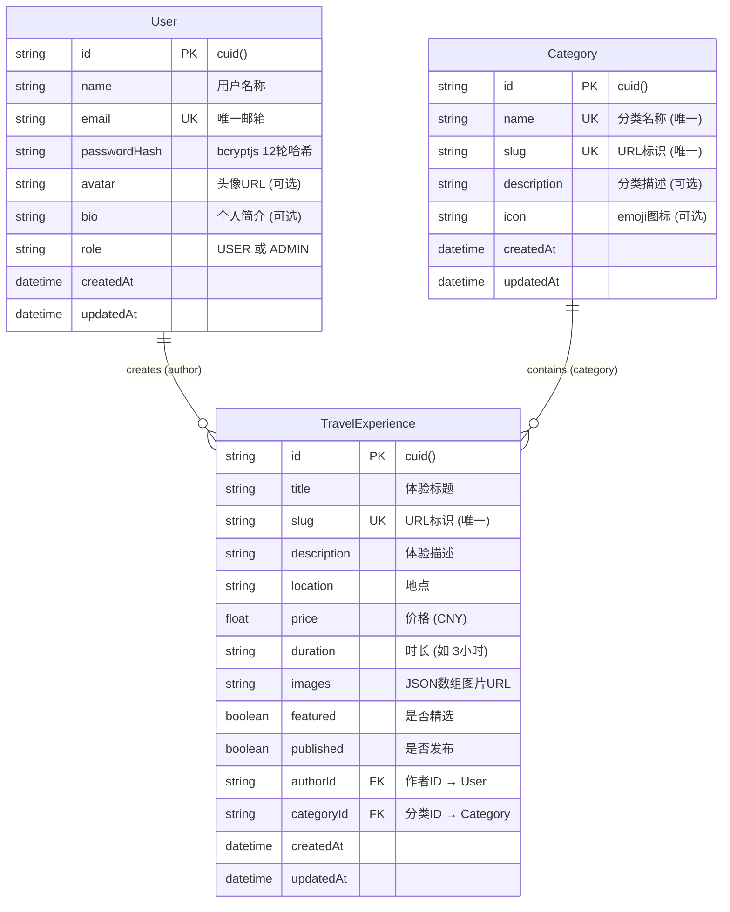

# ER 图（实体关系图）

## Mermaid 图

## 关系说明

### User → TravelExperience (1:N)
- 一个用户可以创建多个旅行体验
- 删除用户时，关联的体验不会级联删除（需手动处理）
- `authorId` 为外键，指向 `User.id`

### Category → TravelExperience (1:N)
- 一个分类下可以有多个旅行体验
- 删除分类时，如果存在关联体验，API 层面会拒绝删除
- `categoryId` 为外键，指向 `Category.id`

## 技术实现

- **数据库**：SQLite，文件存储（`prisma/dev.db`）
- **ORM**：Prisma 7，使用 `@prisma/adapter-better-sqlite3` 驱动
- **ID 生成**：cuid()，自动生成唯一标识符
- **时间戳**：createdAt（自动设置创建时间），updatedAt（自动更新修改时间）

## 种子数据

通过 `npm run db:seed` 初始化：

| 表 | 数量 | 说明 |
|---|---|---|
| User | 1 | admin@100ways.com / admin123 (ADMIN) |
| Category | 5 | 城市探索 / 自然风光 / 美食之旅 / 极限冒险 / 文化体验 |
| TravelExperience | 8 | 各分类 1-2 个体验，覆盖东京/冰岛/成都/巴黎/尼泊尔/京都/新西兰/曼谷 |
